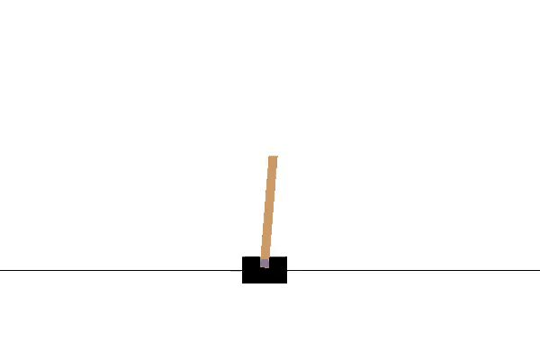
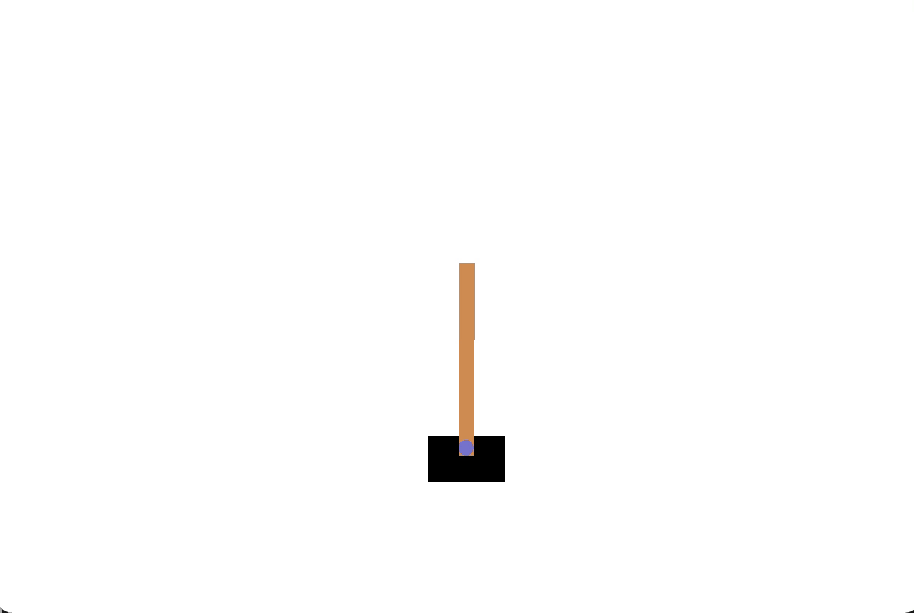

# pytorch-DQN
Pytorch implementation of DQN

## DQN
The original Q-learning uses tabular method(see https://github.com/williamium3000/tabular-Q-learning-Sarsa for more details and implementation) to solve, however, the problem with tabular Q-learning appears when the states grows since table is not enough to store millions of millions states given in an environments. For instance, a game with environment presented as a 210x180 black and white pixels.
There will be $2^{180 * 210}$ possible states, which is way too much for a table to handle. 

The DeepMind introduce the combination of deep learning and Q-learning in the form of DQN using deep neural network to approximate values, first beats human at games.
Simply put, DQN replace the table with deep neural nets(CNN or DNN) and use a target network to perform the Bellman equation update. To implement it, a few tricks is
used such as a target network and experience replay. The target network is introduced to converge the model since frequently update 
puts the model in an unstable state. Experience replay uses a buffer to store all the past (state, action, next\_state) pairs and train the model by sampling the past experience, this
helps metigate the correlation between trainning examples.
To formulize DQN, we define the neural network as a mapping from states to values 
$Q(s, a;\theta_i)$ and the target network being the 
temporarily optimal value function $Q^*$, then we have our target and loss:
$$y_i = Q^*(s, a) = E_{s'~\epsilon}[r + \gamma \max_a'Q^*(s', a') |s, a]$$
$$L_i(\theta_i) = E_{s, a~\rho (·)}[(y_i - Q(s, a;\theta_i))^2]$$

Then we do backprop on this loss.

## Experiments and results
### Environments

#### CartPole-v0
CartPole-v0 involves a pole on a car and an agent is required to hold control of the car(left/right) in order to prevent the pole from falling. Each step, the agent is rewarded 1 if the pole fails to fall, with a maximum steps of 200.

#### MountainCar-v0
MountainCar-v0 involves a car in a valley and an agent is required to control the car to drive up the mountain on the right. However, the car's engine is not strong enough to scale the mountain in a single pass. Therefore, the agent is required to learn to drive back and forth to build up momentum.

### Results
Both environments uses agents trained for 1000 episodes with a learning rate of 0.001, batch size of 64, learning frequency of 3, gamma of 0.99 and a $\epsilon$-greedy of 0.1(1e-6 decrement every step)
#### CartPole-v0
The following is loss with respect to episodes

And a demo of the trained agents

